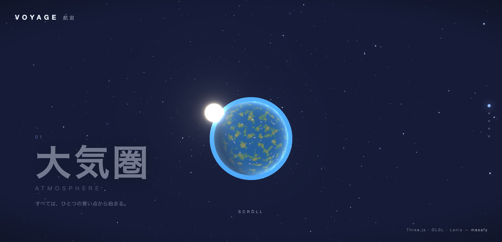
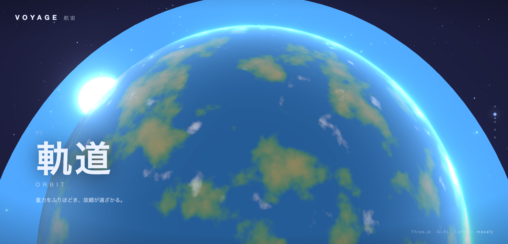
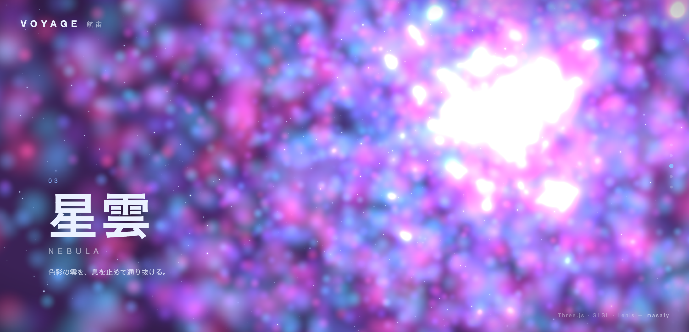
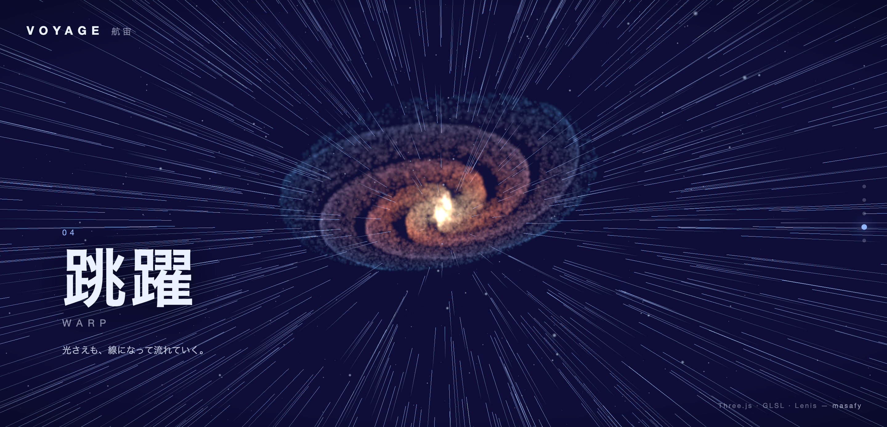
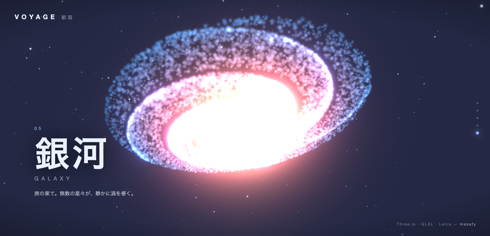

# 🌌 VOYAGE — 航宙

> スクロールするだけで、惑星の大気圏から銀河の核へ。一本道のシネマティックな宇宙の旅。

VOYAGE はスクロール連動のシネマティック 3D 宇宙体験です。1 ページ・クリック不要で、スクロール位置がそのままカメラとなり、惑星の大気圏から軌道へ、色彩の星雲を抜け、ハイパースペース跳躍を越え、遠い銀河の輝く核へと飛んでいきます。Three.js + GLSL + Lenis で構築しています。


🔗 **[Live Demo](https://voyage.1qaz.jp)**

---

## 📸 スクリーンショット



| Orbit | Nebula |
|---|---|
|  |  |

| Warp | Galaxy |
|---|---|
|  |  |

---

## 🎬 旅の構成 / 見方

スクロールは正規化された単一の進行値 `p ∈ [0, 1]` にマッピングされ、カメラをトラック上で動かしながら 5 つのシーンをクロスフェードさせます。

| # | 章 | 見えるもの |
|---|---|---|
| 01 | 大気圏 · ATMOSPHERE | プロシージャル地表をもつ輝く母惑星、加算合成の大気シェル、惑星の縁ですぐ脇にフレアする太陽 |
| 02 | 軌道 · ORBIT | カメラが惑星上空を低く引き寄せ、明暗境界線（ターミネータ）に沿って大気のリムが光る |
| 03 | 星雲 · NEBULA | マゼンタ・バイオレット・シアンのガス雲の中心を通過。数千の加算ポイントで構成 |
| 04 | 跳躍 · WARP | 星々が放射状の筋へ伸びる、定番のハイパースペース跳躍 |
| 05 | 銀河 · GALAXY | 到着。傾いた対数螺旋の銀河。明るい核と青い外腕 |

---

## 🎮 操作方法 / 見方

| 操作 | 動作 |
|---|---|
| スクロール | 旅を前後に進める。これがすべての基本操作 |
| ポインタ移動 | わずかなパララックスが加わる |

---

## ✨ 特徴

- **スムーズスクロール** — [Lenis](https://github.com/darkroomengineering/lenis) が慣性スクロールを駆動し、レンダーループは毎フレーム `scroll / limit` を `p` として読み取る
- **1 つのカメラ、1 本のトラック** — 区分線形の `z` トラックがカメラを `z = 16` から `z = −138` まで動かし、惑星を通過し、星雲を縫い、銀河へ接近する。ポインタ位置が控えめなパララックスを加える
- **すべてがシェーダ** — 星・星雲・銀河はカスタム GLSL で描く GPU ポイントクラウド。惑星地表は Ashima の 3D simplex noise を土台にした fbm によるプロシージャル生成で、fresnel による大気をまとう。warp は単一の `uWarp` uniform で尾を `+z` 方向へ押し戻す `LineSegments` レイヤー
- **加算合成を飼いならす** — 加算合成のポイントクラウドを*通り抜ける*と通常は白飛びする。ポイントサイズをクランプし、近接フェード（`smoothstep(1.5, 14.0, dist)`）でレンズに近づきすぎたポイントを溶かすことで色を保つ
- **呼吸するブルーム** — `UnrealBloomPass` の強度は warp と galaxy で上がり、星雲の内部では*下げて*雲の色彩を保つ

---

## 🛠️ 技術スタック

| カテゴリ | 技術 |
|---|---|
| 3D / 描画 | [Three.js](https://threejs.org/) `0.184` + GLSL（`ShaderMaterial`, `EffectComposer`, `UnrealBloomPass`） |
| スクロール | [Lenis](https://github.com/darkroomengineering/lenis) smooth scroll |
| ビルド | [Vite](https://vitejs.dev/)（純粋な静的出力。バックエンドなし） |

### プロジェクト構成

```
index.html        # オーバーレイ：ブランド、章キャプション、進行レール、スクロールヒント
src/
  main.js         # レンダラ、カメラトラック、scroll → p、フレームごとのシーン制御
  shaders.js      # すべての GLSL（snoise, stars, warp, cloud, planet, atmosphere）
  stars.js        # 背景の星野 + warp ストリークビルダー
  clouds.js       # 星雲 + 螺旋銀河のポイントクラウド
  planet.js       # 惑星地表 + 大気シェル + 太陽
  style.css       # オーバーレイ / タイポグラフィ / ビネット
```

---

## 🚀 セットアップ

```bash
npm install
npm run dev      # http://localhost:5173 で起動
npm run build    # → dist/（静的ファイル。どこへでもデプロイ可能）
```

---

## ライセンス

[](https://opensource.org/licenses/MIT)

このプロジェクトは **MIT ライセンス** のもとで公開しています。

ジェネラティブ / WebGL 実験シリーズの一作で、[FLUX](https://github.com/masafykun/yuragi-flux)、[ORB](https://github.com/masafykun/kodou-orb) と並ぶ作品です。

© 2026 masafykun (https://github.com/masafykun)
